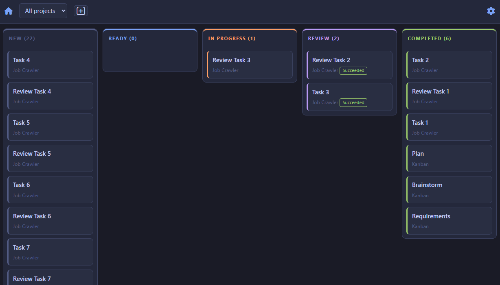

# Kanban for Crush

An AI-powered kanban board for managing development tasks. Drag cards between columns, and an AI agent runner picks up "Ready" cards, creates git branches, runs [Crush](https://github.com/charmbracelet/crush) to implement them, and reports results — all with live log streaming.



## Features

- **Kanban board** — five-column workflow (New, Ready, In Progress, Review, Completed) with drag-and-drop
- **AI card runner** — Windows service that claims Ready cards, creates git branches, invokes Crush with a composed prompt, and classifies outcomes
- **Live run logs** — per-card streaming log viewer on the detail page
- **Project management** — associate cards with git repositories, toggle active projects
- **Theme support** — Tokyo Night, Dracula, Catppuccin, and Nord themes

## Tech Stack

- **Backend:** ASP.NET Core 8, Entity Framework Core
- **Database:** SQL Server (primary) or SQLite (optional)
- **Frontend:** HTMX, SortableJS, CSS custom properties
- **Runner:** .NET 8 Worker Service (Windows Service)

## Configuration

### Connection string

The app reads the connection string from `ConnectionStrings:Kanban` in `appsettings.json` at runtime. At design time (for `dotnet ef` commands), use the `KANBAN_CONNECTION_STRING` environment variable.

| Source | Key | Default |
|--------|-----|---------|
| `appsettings.json` (runtime) | `ConnectionStrings:Kanban` | `Server=localhost;Database=KanbanBoard;Trusted_Connection=True;TrustServerCertificate=True` |
| Environment variable (ef tooling) | `KANBAN_CONNECTION_STRING` | *(same fallback)* |

For SQLite, set the connection string to `Data Source=kanban.db`.

### Web app port

| Context | Source | Default |
|---------|--------|---------|
| Dev (`dotnet run`) | `src/Kanban.Web/Properties/launchSettings.json` → `iisExpress:applicationUrl` | `http://localhost:28763` |
| Prod (IIS) | IIS site binding | `http://*:8080` |

Change the dev port in `launchSettings.json` or pass `--urls` when launching:

```bash
dotnet run --project src/Kanban.Web --urls http://localhost:8080
```

### Runner options

All runner settings live under the `Runner` section in `src/Kanban.Runner/appsettings.json`.

| Setting | Default | Description |
|---------|---------|-------------|
| `Runner:PollIntervalSeconds` | `3` | Seconds between polls for ready cards |
| `Runner:AgentTimeoutMinutes` | `20` | Max time allowed per agent run |
| `Runner:AgentCommand` | `crush` | Executable launched for each card |
| `Runner:AgentArgumentTemplate` | `run` | Args passed to the command; `{promptFile}` token supported |
| `Runner:AgentPromptViaStdin` | `true` | Whether the prompt is piped via stdin |
| `Runner:LogFlushIntervalMs` | `1000` | Flush interval for streaming log lines to DB |
| `Runner:PromptDirectory` | `C:\ProgramData\Kanban\prompts` | Where prompt files are written |

### Crush / OpenRouter

The runner spawns `crush` as a subprocess. Crush reads its API key from the environment:

| Variable | Purpose |
|----------|---------|
| `OPENROUTER_API_KEY` | Set at machine level so the Windows Service account can see it |

### ASP.NET environment

| Variable | Default | Source |
|----------|---------|--------|
| `ASPNETCORE_ENVIRONMENT` | `Development` | `launchSettings.json` (Web) |
| `DOTNET_ENVIRONMENT` | `Development` | `launchSettings.json` (Runner) |

In production, set these to `Production` via IIS or the service configuration.

### User secrets (Runner)

The Runner project supports [.NET User Secrets](https://learn.microsoft.com/en-us/aspnet/core/security/app-secrets) for sensitive values during development (e.g., connection strings):

```bash
dotnet user-secrets set "ConnectionStrings:Kanban" "<your-string>" --project src/Kanban.Runner
```

## Quick Start

### Prerequisites

- [.NET 8 SDK](https://dotnet.microsoft.com/download/dotnet/8.0)
- SQL Server (any edition) or SQLite

### Setup

```bash
git clone <repo-url>
cd kanban-tracker

# Set your connection string (SQL Server default)
set KANBAN_CONNECTION_STRING=Server=localhost;Database=KanbanBoard;Trusted_Connection=True;TrustServerCertificate=True
# Or use SQLite:
# set KANBAN_CONNECTION_STRING=Data Source=kanban.db

make restore
make build

# Create the database
dotnet ef database update --project src/Kanban.Core --startup-project src/Kanban.Web

# Start the web app
dotnet run --project src/Kanban.Web
```

Open `http://localhost:28763` in your browser.

### Running the AI Runner (optional)

The runner invokes [Crush](https://github.com/charmbracelet/crush) to process cards. See [docs/deployment.md](docs/deployment.md) for full setup.

```bash
dotnet run --project src/Kanban.Runner
```

## Documentation

- [Setup](docs/setup.md) — end-to-end deployment guide
- [Deployment](docs/deployment.md) — IIS + Windows Service quick reference
- [Testing](docs/testing.md) — test suite and database setup
- [Crush invocation](docs/crush-invocation.md) — verified Crush CLI command reference

## License

MIT
